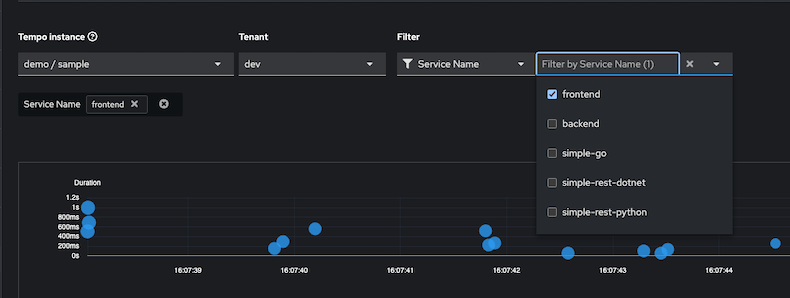

# OpenShift - OpenTelemetry with Tempo

|                   | 

- [OpenShift - OpenTelemetry with Tempo](#openshift---opentelemetry-with-tempo)
  - [Operators](#operators)
    - [Tempo Operator](#tempo-operator)
      - [Tempo Monolithic](#tempo-monolithic)
    - [Distributed Tracing Data Collection Operator](#distributed-tracing-data-collection-operator)
      - [Config OTEL Collector](#config-otel-collector)
    - [Cluster Observability Operator](#cluster-observability-operator)
      - [Tracing UI](#tracing-ui)
  - [Todo Application (with OpenTelemetry library)](#todo-application-with-opentelemetry-library)
  - [OTEL Auto-Instrumentation](#otel-auto-instrumentation)
    - [Todo App (without OpenTelemetry library)](#todo-app-without-opentelemetry-library)
    - [RESTful App](#restful-app)
      - [Node.js](#nodejs)
      - [Go-lang](#go-lang)
      - [Java App](#java-app)
      - [Test RESTful App](#test-restful-app)


## Operators
- Create project demo

```bash
PROJECT=demo
oc new-project $PROJECT
```

### Tempo Operator

- Install [Tempo Operator](config/tempo-sub.yaml)

```bash
oc create -f config/tempo-sub.yaml
oc wait --for condition=ready --timeout=300s pod -l app.kubernetes.io/name=tempo-operator  -n openshift-tempo-operator
oc get po -l app.kubernetes.io/name=tempo-operator -n openshift-tempo-operator
```

Output

```bash
namespace/openshift-tempo-operator created
operatorgroup.operators.coreos.com/openshift-tempo-operator-svgqj created
subscription.operators.coreos.com/tempo-product created
pod/tempo-operator-controller-797d6cb7d6-bg9zz condition met
NAME                                         READY   STATUS    RESTARTS   AGE
tempo-operator-controller-797d6cb7d6-bg9zz   1/1     Running   0          5m41s
```
- Verify operators are installed successfully

```bash
oc get csv -n openshift-operators

```

Output

```bash
NAME                                DISPLAY                          VERSION     REPLACES                            PHASE
tempo-operator.v0.15.4-1            Tempo Operator                   0.15.4-1    tempo-operator.v0.15.3-1            Succeeded
```

#### Tempo Monolithic

- Create [Tempo Monolithic](config/tempoMonolithic.yaml) instance in project demo

```bash
cat config/tempoMonolithic.yaml | sed 's/PROJECT/'$PROJECT'/g' | oc create -f -
```
Output

```bash
clusterrole.rbac.authorization.k8s.io/tempostack-traces-write created
clusterrole.rbac.authorization.k8s.io/tempostack-traces-reader created
clusterrolebinding.rbac.authorization.k8s.io/tempostack-traces-reader created
serviceaccount/otel-collector created
clusterrolebinding.rbac.authorization.k8s.io/tempostack-traces created
tempomonolithic.tempo.grafana.com/sample created
```

- Check TempoMonolithic operator status

```bash
oc wait --for condition=ready --timeout=300s pod -l app.kubernetes.io/name=tempo-monolithic -n $PROJECT
oc get po -l app.kubernetes.io/component=tempo -n $PROJECT
```

Output

```bash
NAME             READY   STATUS    RESTARTS   AGE
tempo-sample-0   5/5     Running   0          59s
```

- Check PVC created by Tempo Operator

```bash
oc get pvc -n $PROJECT
```

Output

```bash
NAME                           STATUS   VOLUME                                     CAPACITY   ACCESS MODES   STORAGECLASS   VOLUMEATTRIBUTESCLASS   AGE
tempo-storage-tempo-sample-0   Bound    pvc-13ef64d5-ca36-41a9-bcd1-81e82fa540f5   2Gi        RWO            gp3-csi        <unset>                 2m21s
```

### Distributed Tracing Data Collection Operator
- Install [Distributed Tracing Data Collection Operator](config/otel-sub.yaml)

```bash
oc create -f config/otel-sub.yaml
oc wait --for condition=ready --timeout=300s pod -l app.kubernetes.io/name=opentelemetry-operator -n openshift-operators

```

Output

```bash
subscription.operators.coreos.com/opentelemetry-product created
```

- Verify operators are installed successfully

```bash
oc get csv -n openshift-operators
```

Output

```bash
NAME                                DISPLAY                          VERSION     REPLACES                            PHASE
opentelemetry-operator.v0.119.0-2   Red Hat build of OpenTelemetry   0.119.0-2   opentelemetry-operator.v0.119.0-1   Succeeded
tempo-operator.v0.15.4-1            Tempo Operator                   0.15.4-1    tempo-operator.v0.15.3-1            Succeeded
```

#### Config OTEL Collector

- Create OTEL collector

```bash
cat config/otel-collector-multi-tenant.yaml | sed 's/PROJECT/'$PROJECT'/' | oc apply -n $PROJECT -f -
oc wait --for condition=ready --timeout=180s pod -l app.kubernetes.io/name=otel-collector  -n $PROJECT
oc get po -l  app.kubernetes.io/managed-by=opentelemetry-operator -n $PROJECT
```

Output

```bash
opentelemetrycollector.opentelemetry.io/otel created
pod/tempo-sample-0 condition met
NAME                              READY   STATUS    RESTARTS   AGE
otel-collector-54bc66dd66-gfl2t   1/1     Running   0          2m6s
```

### Cluster Observability Operator
- Install [Cluster Observability Operator](config/cluster-observability-sub.yaml)

```bash
oc create -f config/observability-sub.yaml
```

Output

```bash
namespace/openshift-cluster-observability-operator created
operatorgroup.operators.coreos.com/openshift-cluster-observability-operator-ds9pl created
subscription.operators.coreos.com/cluster-observability-operator created
```

- Verify operators are installed successfully

```bash
oc get csv -n openshift-operators  
```

Output

```bash
NAME                                    DISPLAY                          VERSION     REPLACES                                PHASE
cluster-observability-operator.v1.1.1   Cluster Observability Operator   1.1.1       cluster-observability-operator.v1.1.0   Succeeded
opentelemetry-operator.v0.119.0-2       Red Hat build of OpenTelemetry   0.119.0-2   opentelemetry-operator.v0.119.0-1       Succeeded
tempo-operator.v0.15.4-1                Tempo Operator                   0.15.4-1    tempo-operator.v0.15.3-1                Succeeded
```

#### Tracing UI
- Create [Tracing UI Plugin](config/ui-plugin.yaml)

```bash
oc create -f config/ui-plugin.yaml
```

Output

```bash
uiplugin.observability.openshift.io/distributed-tracing created
```

- Check that menu Trace is available under Observe


## Todo Application (with OpenTelemetry library)
- Deploy sample todo application. This application is developed by Quarkus with OpenTelemetry library

```bash
oc create -k todo-kustomize/overlays/otel -n $PROJECT
oc wait --for condition=ready --timeout=180s pod -l app=todo-db  -n $PROJECT 
oc wait --for condition=ready --timeout=180s pod -l app=todo  -n $PROJECT
```
Output
```bash
configmap/todo-db-init created
secret/todo-db created
service/todo created
service/todo-db created
persistentvolumeclaim/todo-db created
persistentvolumeclaim/todo-db-init-data created
deployment.apps/todo created
deployment.apps/todo-db created
route.route.openshift.io/todo created
pod/todo-db-77b5754784-swf7x condition met
pod/todo-7c6bddcdcb-t7pt6 condition met
```

- Verify todo application 
  
  

- Access todo app and do some operations i.e. add tasks, set task's status to completed and delete tasks.
  


- Navigate to Observe -> Trace
  Select Tempo Instance to *demo/sample* and Tenant to *dev*

  

- Select trace and check its details
  
  Update todo's status

  

  
  SQL Statement

  


## OTEL Auto-Instrumentation
- Create [Instrumentation](config/instrumentation.yaml)
```bash
oc create -f config/instrumentation.yaml -n $PROJECT
```
Output
```bash
instrumentation.opentelemetry.io/instrumentation created
```
### Todo App (without OpenTelemetry library)
- Replace Todo Application to version that does not included opentelemetry library
```bash
oc delete -k todo-kustomize/overlays/otel -n $PROJECT
oc apply -k todo-kustomize/base -n $PROJECT
```
- Patch deployment to annotate with *instrumentation.opentelemetry.io/inject-java=true* and set environment variable

```bash
oc patch deployment/todo \
-p '{"spec":{"template":{"metadata":{"annotations":{"instrumentation.opentelemetry.io/inject-java":"true"}}}}}' \
-n $PROJECT
oc set env deploy todo \
OTEL_EXPORTER_OTLP_ENDPOINT=http://otel-collector-headless:4318 \
-n $PROJECT
 oc set env deploy todo OTEL_TRACES_SAMPLER_ARG="drop=/;drop=/q/health/live;drop=/q/health/ready;fallback=always_on" \
 -n $PROJECT
```
<!-- oc set env deploy todo quarkus.otel.exporter.otlp.endpoint- \
-n $PROJECT -->
- Check todo's pod
  
  Init Container

  

  Todo pod log

  ```log
  INFO exec -a "java" java -Dquarkus.http.host=0.0.0.0 -Djava.util.logging.manager=org.jboss.logmanager.LogManager -cp "." -jar /deployments/quarkus-run.jar
  INFO running in /deployments
  Picked up JAVA_TOOL_OPTIONS: -javaagent:/otel-auto-instrumentation-java/javaagent.jar
  OpenJDK 64-Bit Server VM warning: Sharing is only supported for boot loader classes because bootstrap classpath has been appended
  [otel.javaagent 2025-05-04 13:27:02:012 +0000] [main] INFO io.opentelemetry.javaagent.tooling.VersionLogger - opentelemetry-javaagent - version: 1.33.6
  ```
- Test todo app again and verify that traces still created even app container image does not contains openTelemetry library.
- Specified TraceQL *{rootServiceName="todo" && span.db.statement!="unknown"}*


### RESTful App
#### Node.js
- Deploy Node.js app

```bash
oc create -f config/frontend.yaml -n $PROJECT
```

Output

```bash
deployment.apps/frontend created
service/frontend created
route.route.openshift.io/frontend created
```

- Annotate deployment for auto-instrumentation

```bash
oc patch deployment/frontend \
    -p '{"spec":{"template":{"metadata":{"annotations":{"instrumentation.opentelemetry.io/inject-nodejs":"true"}}}}}' \
    -n $PROJECT
```

Output

```bash
deployment.apps/frontend patched
```
- Verify that auto-instrumentation is working with init-container

```bash
oc get po $(oc get po -l app=frontend -o custom-columns='Name:.metadata.name' -n $PROJECT --no-headers) -n $PROJECT -o jsonpath='{.status.initContainerStatuses}'|jq
```

Output

```json
[
  {
    "containerID": "cri-o://8461a346ece60ba52018f6395b1133298c26d532a0d411a30e5d147bee089fc0",
    "image": "ghcr.io/open-telemetry/opentelemetry-operator/autoinstrumentation-nodejs:0.53.0",
    "imageID": "ghcr.io/open-telemetry/opentelemetry-operator/autoinstrumentation-nodejs@sha256:70ba757df71d0596aaccac91f439e8be7f81136b868205e79178e8fd3c36a763",
    "lastState": {},
    "name": "opentelemetry-auto-instrumentation-nodejs",
    "ready": true,
    "restartCount": 0,
    "started": false,
    "state": {
      "terminated": {
        "containerID": "cri-o://8461a346ece60ba52018f6395b1133298c26d532a0d411a30e5d147bee089fc0",
        "exitCode": 0,
        "finishedAt": "2025-05-05T07:22:25Z",
        "reason": "Completed",
        "startedAt": "2025-05-05T07:22:23Z"
      }
    },
    "volumeMounts": [
      {
        "mountPath": "/otel-auto-instrumentation-nodejs",
        "name": "opentelemetry-auto-instrumentation-nodejs"
      },
      {
        "mountPath": "/var/run/secrets/kubernetes.io/serviceaccount",
        "name": "kube-api-access-6zqld",
        "readOnly": true,
        "recursiveReadOnly": "Disabled"
      }
    ]
  }
]
```
- Set environment variables

```bash
oc set env deploy frontend OTEL_EXPORTER_OTLP_ENDPOINT=http://otel-collector-headless:4318 -n $PROJECT
oc set env deploy frontend OTEL_SERVICE_NAME=frontend -n $PROJECT
oc set env deploy frontend OTEL_PROPAGATORS=tracecontext,b3 -n $PROJECT
```

#### Go-lang

*Remark: With opentelemetry-operator.v0.119.0-2 and go autoinstrumentation-go:v0.20.0 only work with golang 1.23*

- Create [SCC](config/otel-go-instrument-scc.yaml) for for go-lang instrumentation 

```bash
 oc create -f config/otel-go-instrument-scc.yaml -n $PROJECT
```

- Create Service Account for go-lang pod and add SCC to this service account

```bash
oc create sa go-lang-runner
oc adm policy add-scc-to-user otel-go-instrumentation-scc -z go-lang-runner
```

- Deploy [simple-go app](config/simple-go.yaml)

```bash
oc create -f config/simple-go.yaml -n $PROJECT
```

Output

```bash
deployment.apps/simple-go created
service/simple-go created
```

- Check [simple-go deployment](config/simple-go.yaml)
  - Annotations
    
    ```yaml
      template:
        metadata:
          annotations:
            instrumentation.opentelemetry.io/inject-go: "true"
            instrumentation.opentelemetry.io/otel-go-auto-target-exe: /app/api
            openshift.io/required-scc: otel-go-instrumentation-scc
    ```
  
  - Enviornment variables
    
    ```yaml
            - name: OTEL_EXPORTER_OTLP_ENDPOINT
              value: http://otel-collector-headless:4318
            - name: OTEL_SERVICE_NAME
              value: simple-go
            - name: OTEL_GO_AUTO_TARGET_EXE
              value: /app/api
            - name: OTEL_PROPAGATORS
              value: tracecontext,b3
    ```

- Verify that auto-instrumentation is working with container sidecar

```bash
oc get po -l app=simple-go -n $PROJECT
oc get po $(oc get po -l app=simple-go -o custom-columns='Name:.metadata.name' -n $PROJECT --no-headers) -n $PROJECT -o jsonpath='{.spec.containers[1].name}'
```

Output

```bash
NAME                        READY   STATUS    RESTARTS   AGE
simple-go-56f8c644b-w4sxw   2/2     Running   0          7m42s
opentelemetry-auto-instrumentation
```

#### Java App
- Deploy [Java RESTful App](config/backend.yaml)

```bash
oc create -f config/backend.yaml -n $PROJECT
```

- Check [backend deployment](config/backend.yaml)
  - Annotations
    
    ```yaml
      template:
        metadata:
          annotations:
            instrumentation.opentelemetry.io/inject-java: "true"
    ```
  
  - Enviornment variables
    
    ```yaml
            - name: OTEL_EXPORTER_OTLP_ENDPOINT
              value: http://otel-collector-headless:4318
            - name: OTEL_SERVICE_NAME
              value: backend
            - name: OTEL_PROPAGATORS
              value: tracecontext,b3
    ```

- Verify that auto-instrumentation is working with init-container

```bash
oc get po $(oc get po -l app=backend -o custom-columns='Name:.metadata.name' -n $PROJECT --no-headers) -n $PROJECT -o jsonpath='{.status.initContainerStatuses}'|jq|head -n 8
```

Output

```json
[
  {
    "containerID": "cri-o://f88eea516f6b51b9bf772b17f88f73ccd920728a8ff4237a855d89a08d2499a9",
    "image": "ghcr.io/open-telemetry/opentelemetry-operator/autoinstrumentation-java:1.33.6",
    "imageID": "ghcr.io/open-telemetry/opentelemetry-operator/autoinstrumentation-java@sha256:502d3170177a0676db8b806eba047a520af9bb83400e734fc64f24a593b2ca64",
    "lastState": {},
    "name": "opentelemetry-auto-instrumentation-java",
    "ready": true,
```

- Check container log

```bash
oc logs $(oc get po -l app=backend -o custom-columns='Name:.metadata.name' -n $PROJECT --no-headers) -n $PROJECT | head -n 4
```

Output

```bash
Defaulted container "backend" out of: backend, opentelemetry-auto-instrumentation-java (init)
INFO exec -a "java" java -Dquarkus.http.host=0.0.0.0 -Djava.util.logging.manager=org.jboss.logmanager.LogManager -cp "." -jar /deployments/quarkus-run.jar
INFO running in /deployments
Picked up JAVA_TOOL_OPTIONS:  -javaagent:/otel-auto-instrumentation-java/javaagent.jar
OpenJDK 64-Bit Server VM warning: Sharing is only supported for boot loader classes because bootstrap classpath has been appended
```

#### Test RESTful App
- Test app

```bash
curl -v https://$(oc get route frontend -n $PROJECT -o jsonpath='{.spec.host}') 
```

Output

```bash
* Connection #0 to host frontend-demo.apps.cluster-4thxh.4thxh.sandbox2298.opentlc.com left intact
Frontend version: v1 => [Backend: http://simple-go:8080, Response: 200, Body: Backend version:v1, Response:200, Host:backend-68589df886-gtbpx, Status:200, Message: Hello, World]
```

- Check trace in console with Query  *{rootServiceName="frontend"}*
  
  

  - Overall Trace
  
  

  - Client information
  
  

  


  


  
<!-- - Annotate deployment for auto-instrumentation

```bash
oc patch deployment/simple-go \
    -p '{"spec":{"template":{"metadata":{"annotations":{"otel-go-auto-target-exe":"/app/api"}}}}}' \
    -n $PROJECT
oc patch deployment/simple-go \
    -p '{"spec":{"template":{"metadata":{"annotations":{"instrumentation.opentelemetry.io/inject-go":"true"}}}}}' \
    -n $PROJECT
oc patch deployment/simple-go \
    -p '{"spec":{"template":{"metadata":{"annotations":{"openshift.io/required-scc":"otel-go-instrumentation-scc"}}}}}' \
    -n $PROJECT
```
- Set environment variables
```bash
oc set env deploy simple-go OTEL_EXPORTER_OTLP_ENDPOINT=http://otel-collector-headless:4318 -n $PROJECT
oc set env deploy simple-go OTEL_SERVICE_NAME=simple-go -n $PROJECT
oc set env deploy simple-go OTEL_PROPAGATORS=tracecontext,b3 -n $PROJECT
oc set env deploy simple-go OTEL_GO_AUTO_TARGET_EXE=/app/api -n $PROJECT
oc scale deploy simple-go --replicas=0 -n $PROJECT;oc scale deploy simple-go --replicas=1 -n $PROJECT
``` -->


<!-- # Warning: 'bases' is deprecated. Please use 'resources' instead. Run 'kustomize edit fix' to update your Kustomization automatically.
# Warning: 'patchesStrategicMerge' is deprecated. Please use 'patches' instead. Run 'kustomize edit fix' to update your Kustomization automatically. -->

<!--
ghcr.io/open-telemetry/opentelemetry-go-instrumentation/autoinstrumentation-go:v0.20.0
>